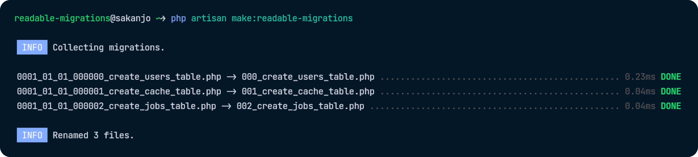

<h1 align="center">✨ Readable migrations</h1>

<p align="center">
    <a href="https://github.com/sakanjo/laravel-readable-migrations/actions"></a>
    <a href="https://laravel.com"></a>
    <a href="https://php.net"></a>
</p>

<p align="center">Change migrations filenames to more readable numeric format.</p>

> ✨ Help support the maintenance of this package by [sponsoring me](https://github.com/sponsors/sakanjo).



Table of Contents
=================

* [Install](#-install)
* [Usage](#-usage)
 * [Options](#options)
    * [1. --pad](#1---pad)
    * [2. --gap](#2---gap)
* [Support the development](#-support-the-development)
* [Credits](#%EF%B8%8F-credits)
* [License](#-license)

## 📦 Install

```
composer require --dev sakanjo/laravel-readable-migrations
```

## 🦄 Usage

```bash
php artisan make:readable-migrations
```

That's it

## Options

### 1. --pad

```bash
php artisan make:readable-migrations --pad=4
```

This option allows you to specify the number of digits to pad the migration number with.

### 2. --gap

```bash
php artisan make:readable-migrations --gap=5
```

This option allows you to specify the number of digits to multiply the migration number by.

## 💖 Support the development

**Do you like this project? Support it by donating**

Click the ["💖 Sponsor"](https://github.com/sponsors/sakanjo) at the top of this repo.

## ©️ Credits

- [Salah Kanjo](https://github.com/sakanjo)
- [All Contributors](../../contributors)

## 📄 License

[MIT License](https://github.com/sakanjo/laravel-readable-migrations/blob/master/LICENSE) © 2023-PRESENT [Salah Kanjo](https://github.com/sakanjo)
